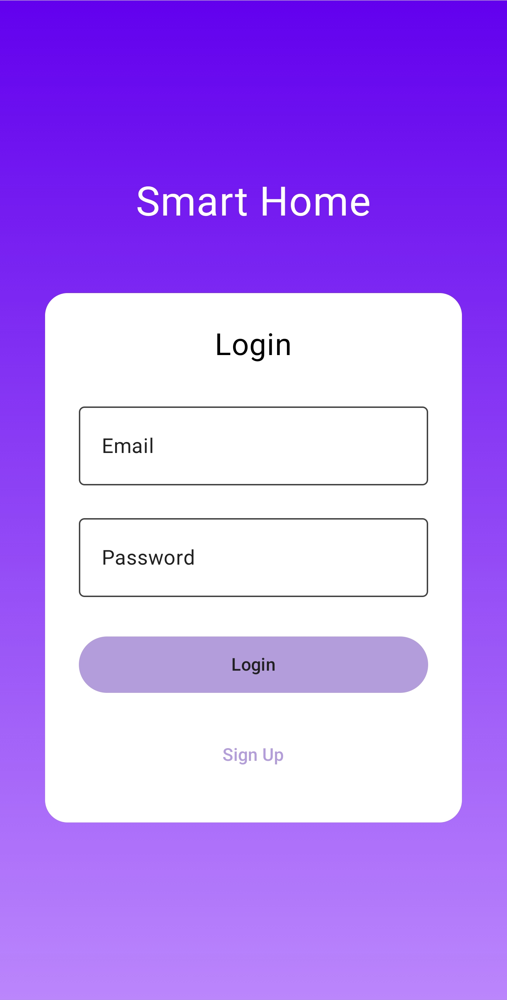
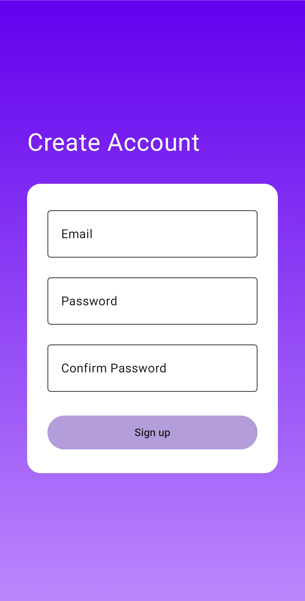
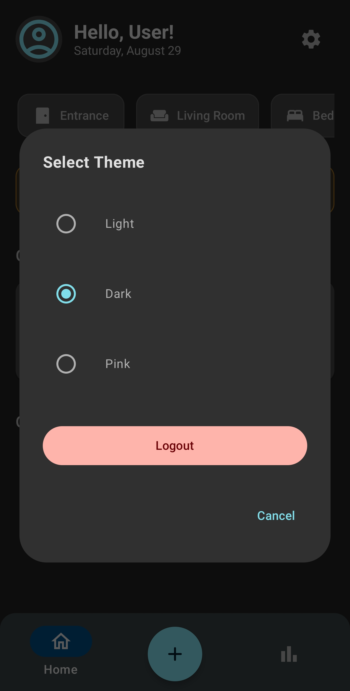
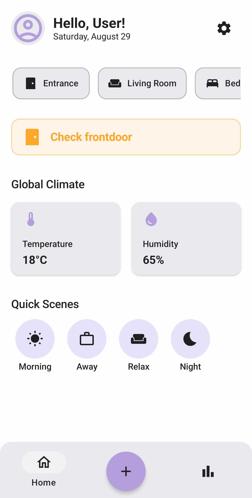
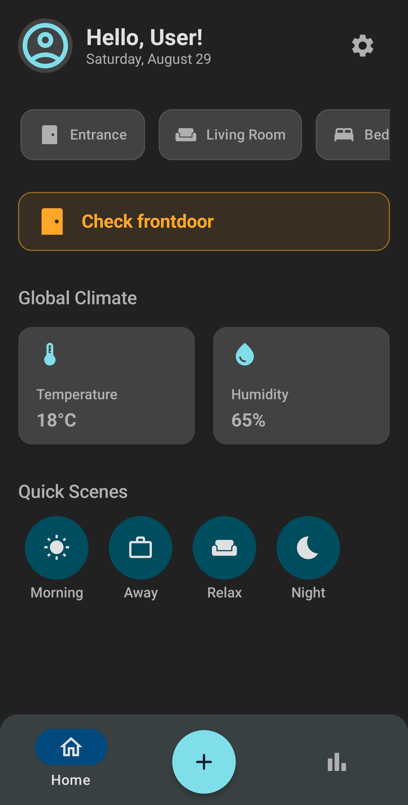
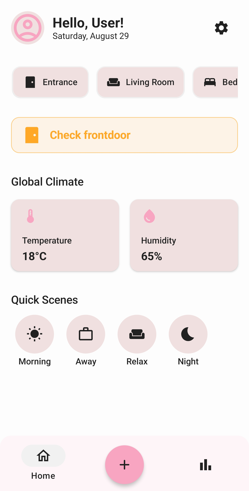
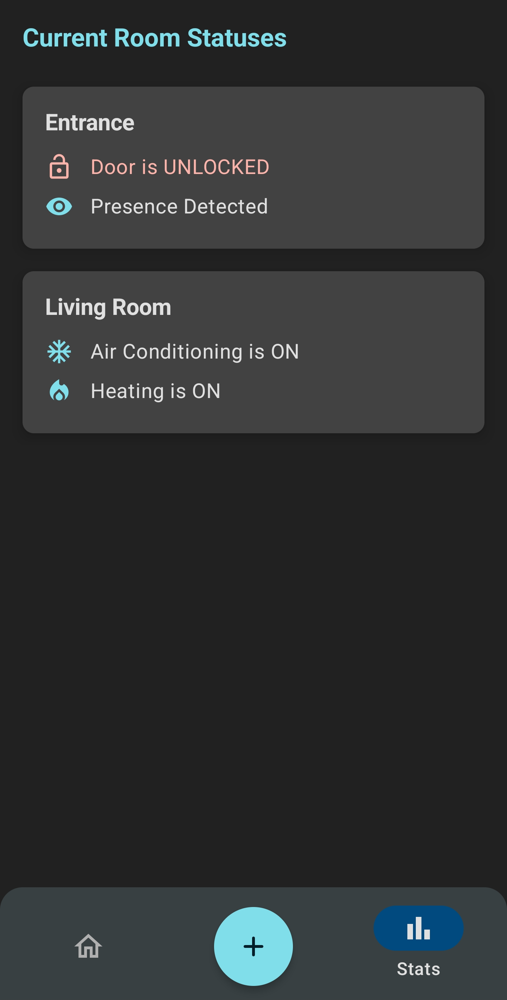
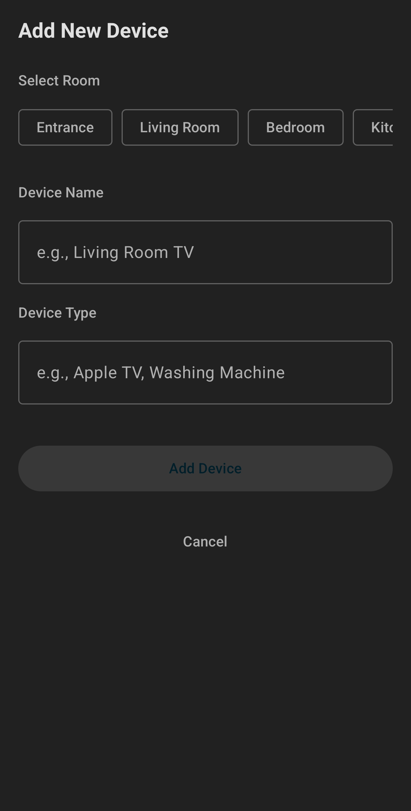
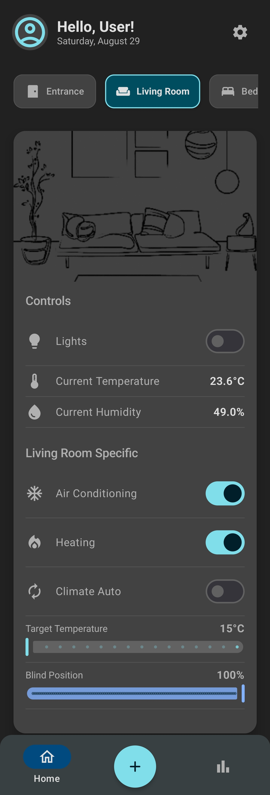

# SmartHome

A **SmartHome IoT control app** for **Android**. It simulates controlling smart devices around the house : lights, sensors, climate control... Backed by a **Firebase Realtime Database** that can be linked to real hardware.

## Screenshots
 
| Login | Sign Up | Settings |
|:---:|:---:|:---:|
|  |  |  |
 
| Light Home | Dark Home | Pink Home |
|:---:|:---:|:---:|
|  |  |  |

| Status | Add Device | Room Example |
|:---:|:---:|:---:|
|  |  |  |

## Tech Stack

- **Language:** Kotlin
- **UI:** Jetpack Compose (Material 3)
- **Navigation:** Navigation Compose
- **Backend:** Firebase Realtime Database
- **Auth:** Firebase Authentication (Email/Password)
- **Local storage:** DataStore
- **Min SDK:** 26 (Android 8.0)
- **Target / Compile SDK:** 35 (Android 15)

## Getting Started

### Prerequisites

- [Android Studio](https://developer.android.com/studio)
- JDK 17
- An Android device or emulator running Android 8.0 (API 26) or higher

### Setup

1. Clone the repository
   ```bash
   git clone https://github.com/thomas-brl/smarthome-app.git
   ```
2. Open the project in Android Studio (**File > Open**, select the cloned folder).
3. Let Gradle sync automatically. If it doesn't, click **File > Sync Project with Gradle Files**.
4. Run the app on an emulator or physical device via **Run > Run 'app'**.
5. On first launch, create an account (email + password) or log in if you already have one.

### Firebase

This app connects to a shared demo **Firebase Realtime Database**, already configured via the included `app/google-services.json`.

If you'd rather run against your own database instead of the shared demo one:
1. Create a free project at the [Firebase Console](https://console.firebase.google.com/).
2. Add an Android app to the project with your own package name (`com.example.smarthome`, or update `applicationId` in `app/build.gradle.kts` to your own).
3. Download the generated `google-services.json` and replace the one in `app/`.
4. Enable **Realtime Database** and **Authentication (Email/Password)** in the console.
5. Apply the database rules from [`database.rules.json`](./database.rules.json) in this repo (Firebase Console > Realtime Database > Rules).

## Project Structure

```
app/src/main/
├── java/com/example/
│   ├── uitheme/             # app theming
│   │   ├── Color.kt
│   │   ├── Theme.kt
│   │   └── Type.kt
│   ├── MainActivity.kt      # app entry point
│   └── MainLogin.kt         # login / sign-up screen
├── res/                     # drawables, layouts, string/style resources
└── AndroidManifest.xml
```

## Testing

```bash
./gradlew test                    # unit tests
./gradlew connectedAndroidTest    # instrumented tests
```

## License

This project is licensed under the MIT License - see the [LICENSE](LICENSE) file for details.
